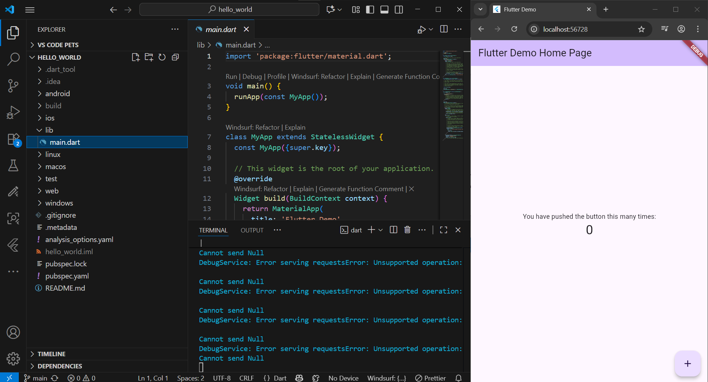

# Pemograman Mobile Gitbook 5
---
# Aplikasi Pertama dan Widget Dasar Flutter

**Nama        : An Naastasya S.**  
**Absensi     : 03**  
**NIM         : 2341760131**  
**Kelas       : SIB 3F**  

---

## Praktikum 1: Membuat Project Flutter Baru  
---
- Buat nama project flutter dengan nama hello_world.  

- Pesan akan tampil berupa *"Your Flutter Project is ready!"* artinya Anda telah berhasil membuat project Flutter baru.  

---
## Praktikum 2: Menghubungkan Perangkat Android atau Emulator
---
- Masuk ke develover mode pada perangkat android, lalu aktifkan USB Debugging.

- Pasang kabel USB ke perangkat android dan laptop, lalu setujui dialog dibawah.

- Tampilan menghubungkan perangkat android.

---
## Praktikum 3: Membuat Repository GitHub dan Laporan Praktikum  
---
- Buat repository baru dengan nama "flutter-fundamental-part1".

- Tampilan apabila repository baru berhasil dibuat.

- Ketik perintah berikut untuk inisialisasi git pada project.

- Pilih menu Source Control di bagian kiri, lalu lakukan stages (+) pada file .gitignore untuk mengunggah file pertama ke repository GitHub.

- Klik "Add Remote" apabila pojok kanan bawah terdapat dialog seperti ini.

- Pilih repository Github.

- Lakukan hal yang sama untuk file readme dan semua file lainnya.

- Tampilan Github apabila berhasil mengunggah semua file.

- Mencoba untuk menjalankan project hello_world.

- Mengubah README.md sehingga tampilan preview akan seperti ini.

---
## Praktikum 4: Menerapkan Widget Dasar  
---
- Tampilan dari hasil basic widgets untuk text widget

- Tampilan dari hasil basic widgets untuk image widget

---
## Praktikum 5: Menerapkan Widget Material Design dan iOS Cupertino  
---
- Tampilan dari hasil basic widgets untuk cupertino button &loading bar

- Tampilan dari hasil basic widgets untuk floating action button

- Tampilan dari hasil basic widgets untuk scaffold widget

- Tampilan dari hasil basic widgets untuk dialog widget

- Tampilan dari hasil basic widgets untuk textfield widget

- Tampilan dari hasil basic widgets untuk date & time pickers

---
