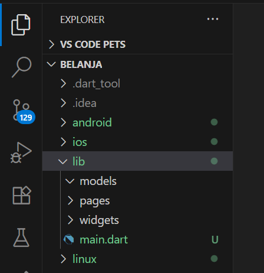
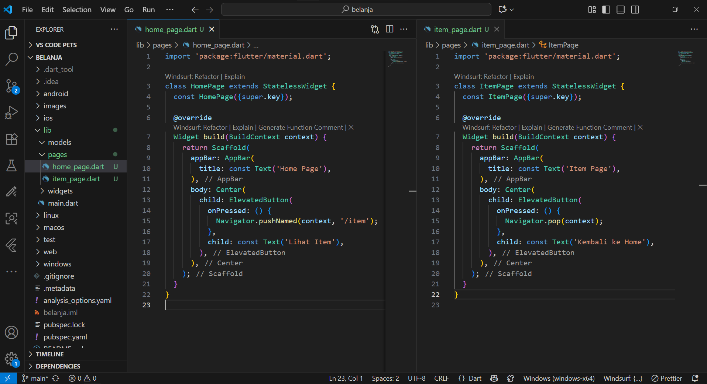
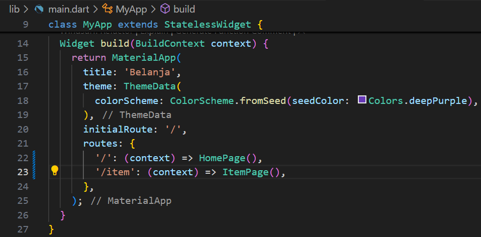
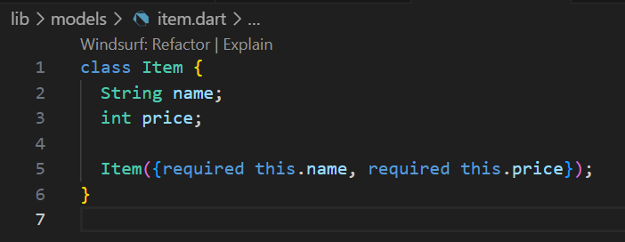
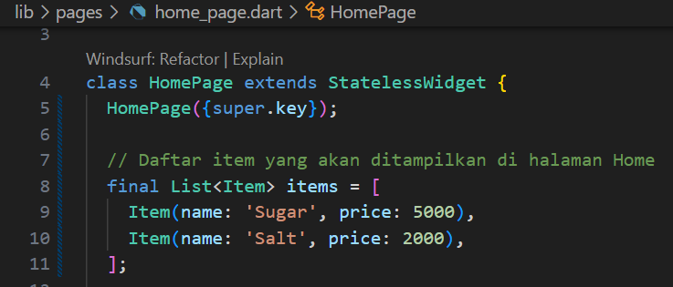
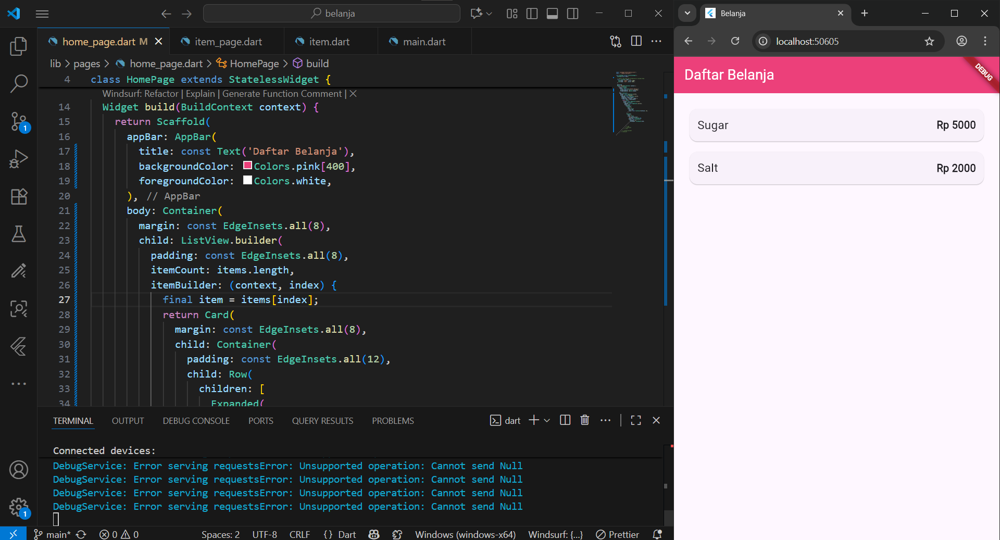
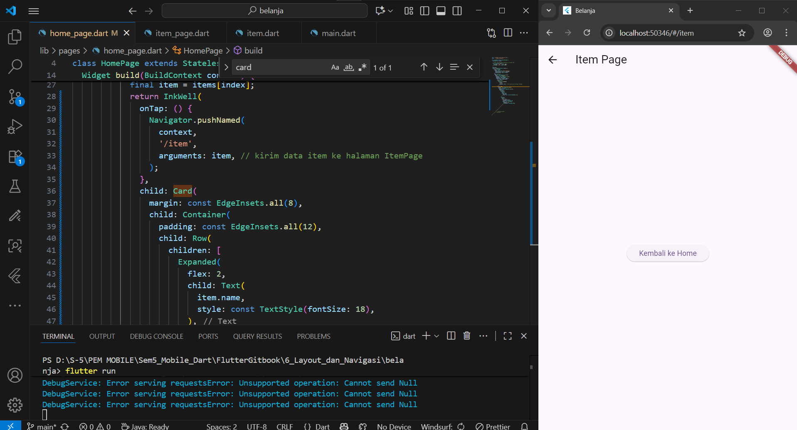
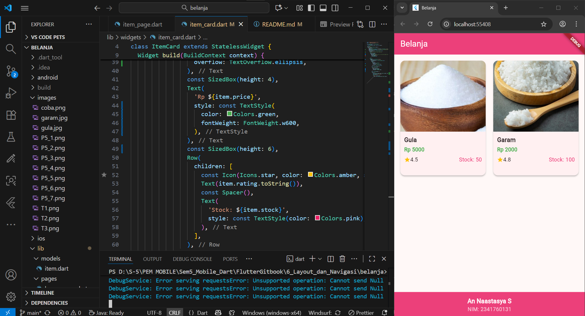
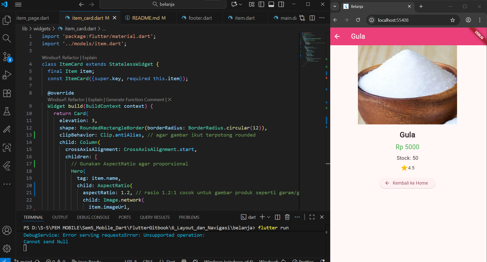
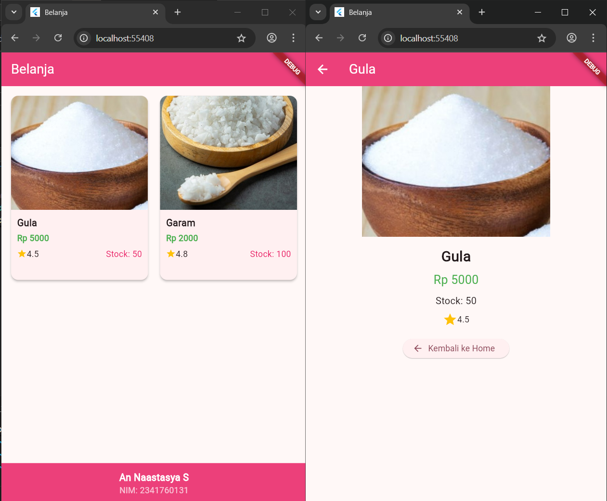

# Pemograman Mobile Gitbook 6
---
# Layout dan Navigasi

**Nama        : An Naastasya S.**  
**Absensi     : 03**  
**NIM         : 2341760131**  
**Kelas       : SIB 3F**  

---

## Praktikum 5: Membangun Navigasi di Flutter
---
- Membuat sebuah project baru Flutter dengan nama belanja, dan susunan folder baru didalam folder lib seperti ini.

- Buatlah dua buah file dart dengan nama home_page.dart dan item_page.dart pada folder pages. Untuk masing-masing file, deklarasikan class HomePage pada file home_page.dart dan ItemPage pada item_page.dart.

- Mendefinisikan Route untuk kedua halaman yang telah dibuat. Definisi penamaan route harus bersifat unique. 

- Membuat sebuah file dengan nama item.dart dan taruh pada folder models, lalu definisikan pemodelan data yang dibutuhkan.

- Sumber data ListView diambil dari model List dari object Item, membuat daftar item

- Membuat ListView dan itemBuilder untuk menampilkan daftar

- Menambahkan aksi pada ListView dengan widget InkWell atau GestureDetector

---
## Tugas Praktikum 2 
---

