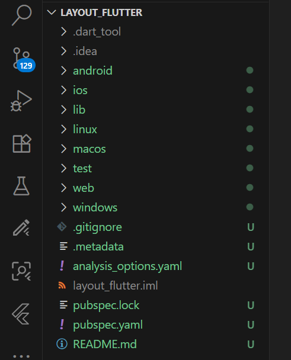
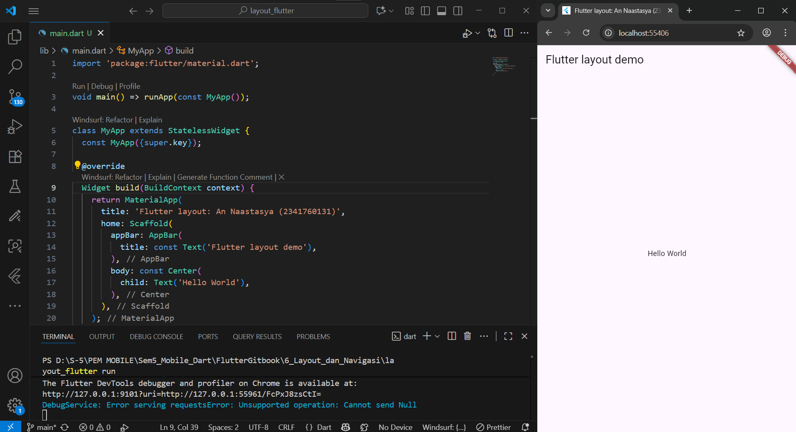
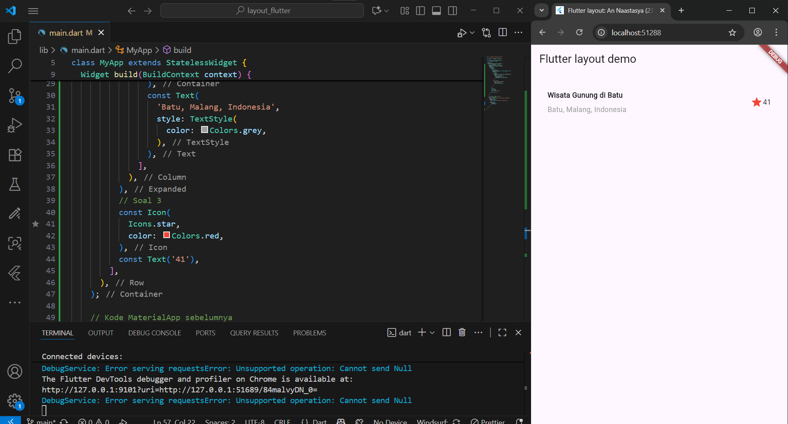
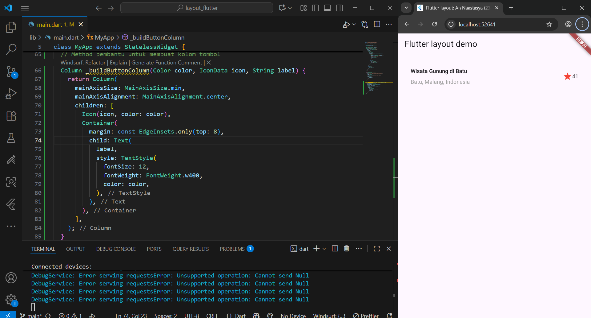
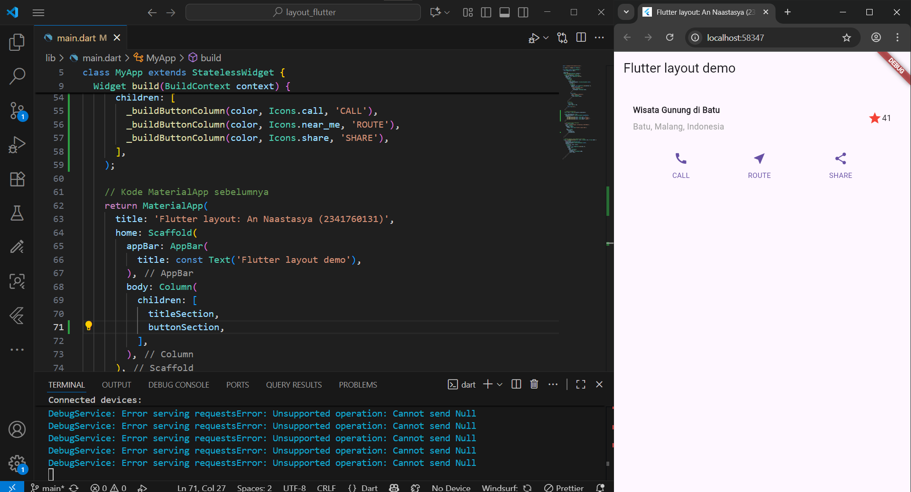
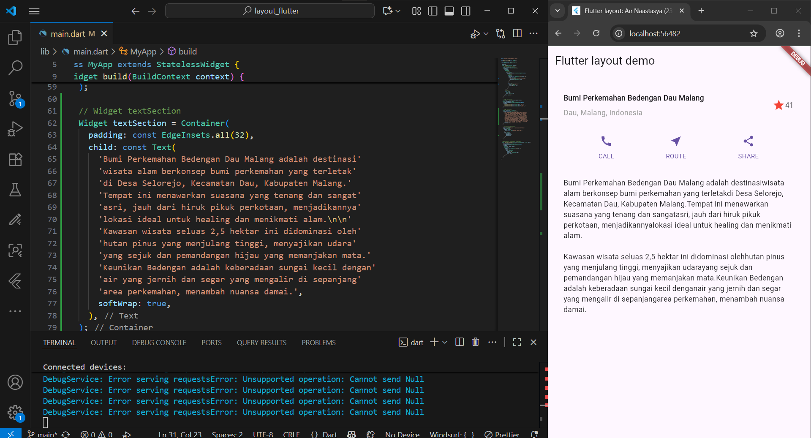
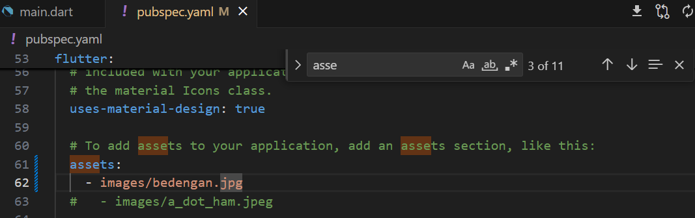
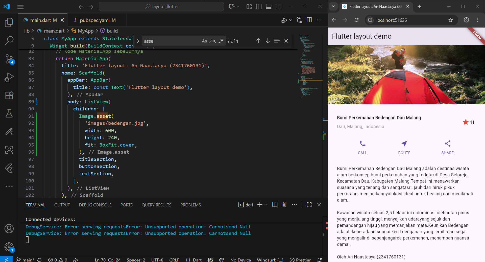

# Pemograman Mobile Gitbook 6
---
# Layout dan Navigasi

**Nama        : An Naastasya S.**  
**Absensi     : 03**  
**NIM         : 2341760131**  
**Kelas       : SIB 3F**  

---

## Praktikum 1: Membangun Layout di Flutter  
---
- Membuat sebuah project flutter baru dengan nama layout_flutter

- Membuka file main.dart dan modifikasi, lalu mengisi nama dan NIM di text title

- Modifikasi  file main.dart dan taruh kode Widget titleSection berikut di bagian atas metode build() di dalam kelas MyApp

---
## Praktikum 2: Implementasi button row
---
- Membuat metode pembantu pribadi bernama buildButtonColumn(), yang mempunyai parameter warna, Icon dan Text, sehingga dapat mengembalikan kolom dengan widgetnya sesuai dengan warna tertentu.

- Menambahkan Widget buttonSection lalu menambahkan widget variabel buttonSection ke dalam body

---
## Praktikum 3: Implementasi text section
---
- Menambahkan Widget textSection lalu menambahkan widget variabel textSection ke dalam body

---
## Praktikum 4: Implementasi image section
---
- Membuat folder images di root project layout_flutter dan memasukkan file gambar tersebut ke folder images, lalu set nama file tersebut ke file pubspec.yaml

- Menmbahkan image aset ke dalam body

