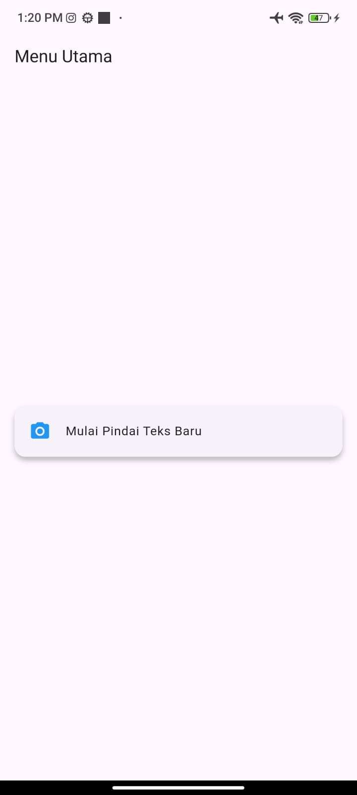
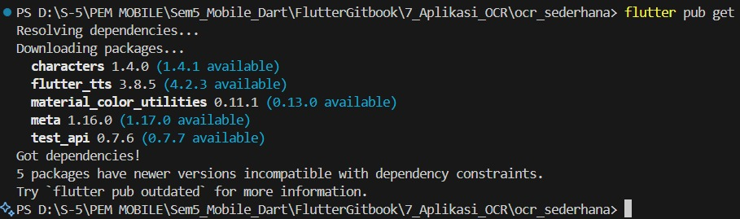

# UTS Pemograman Mobile
---
# Praktikum Aplikasi OCR

**Nama        : An Naastasya S.**  
**Absensi     : 03**  
**NIM         : 2341760131**  
**Kelas       : SIB 3F**  

---

# Instruksi Awal (SETUP)
### Melakukan commit awal untuk memastikan semua file proyek awal sudah tersimpan dengan aman di GitHub.

---
# Soal 1: Modifikasi Struktur Navigasi dan Aliran

## Langkah 1. Pengubahan Navigasi Home

## Langkah 2. Teks Utuh dan Navigasi Balik
### Percobaan dengan kamera yang gagal

### Percobaan denga  kamera yang berhasil

### Apabila tombol home diklik

---
# Soal 2: Penyesuaian Tampilan dan Penanganan State/Error

## Langkah 1. Custom Loading Screen di ScanScreen

## Langkah 2. Spesifikasi Pesan Error

### Setelah tidak memberikan akses kamera kepada aplikasi

---
# Soal 3: Implementasi Plugin Text-to-Speech (TTS)

## Langkah 1. Instalasi Plugin Flutter TTS

## Langkah 2. Konversi Widget dan Inisialisasi dan Langkah 3. Fungsionalitas Pembacaan

## Video Demonstrasi OCR Sederhana dengan TTS
https://drive.google.com/file/d/1AGuXri-4rZ40VWzABbgOnfMjrJkUPW39/view?usp=drivesdk