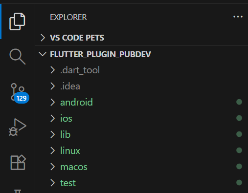
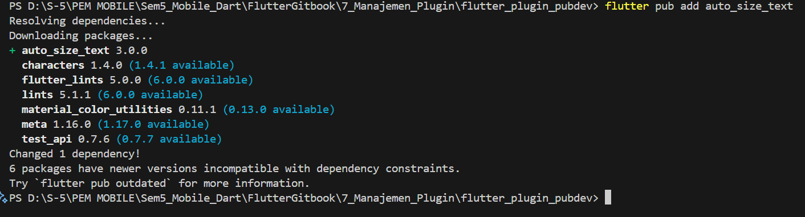
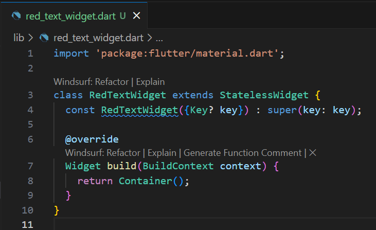
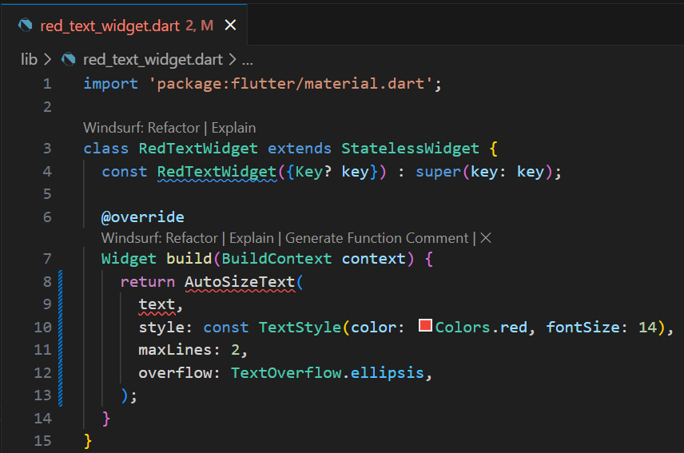
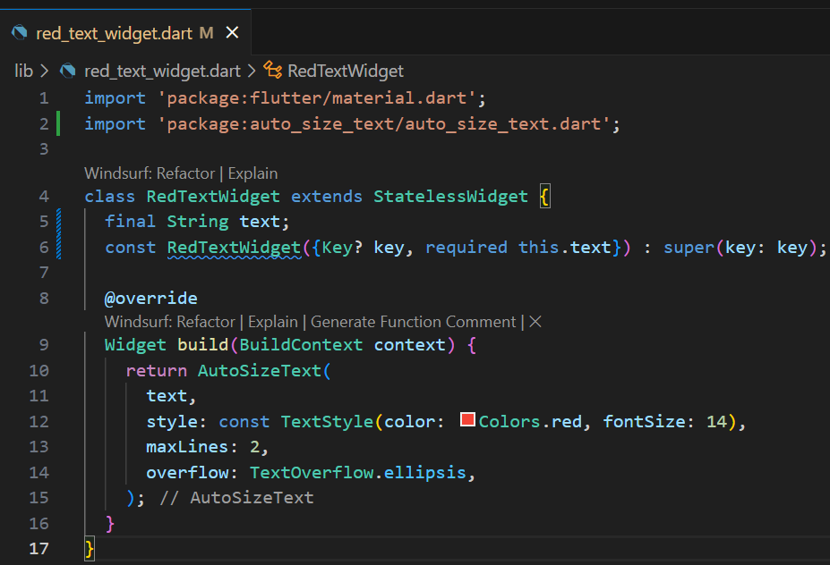
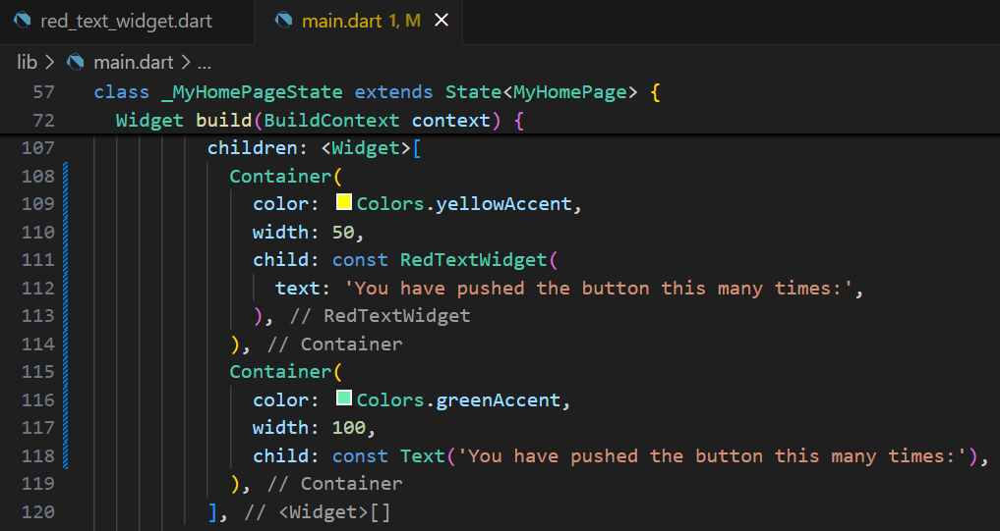
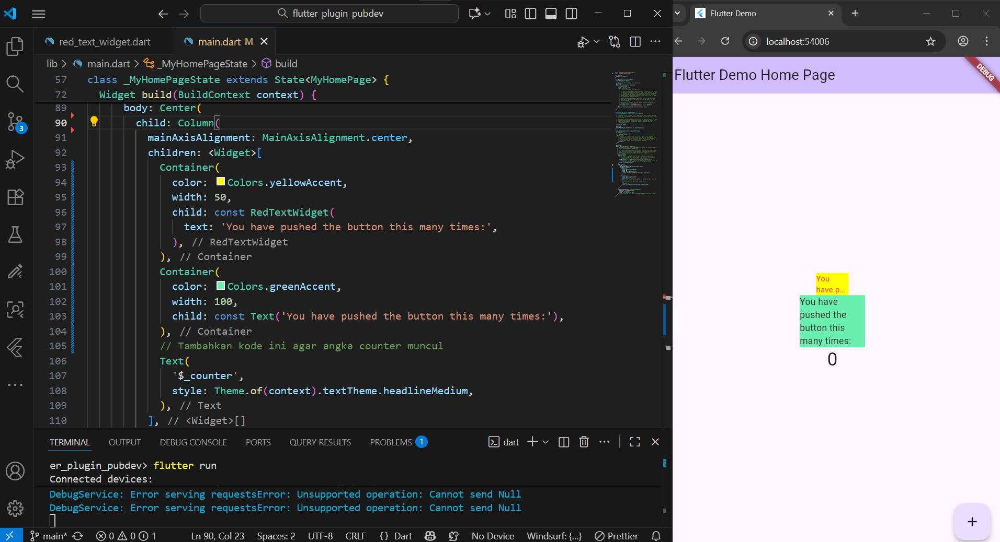
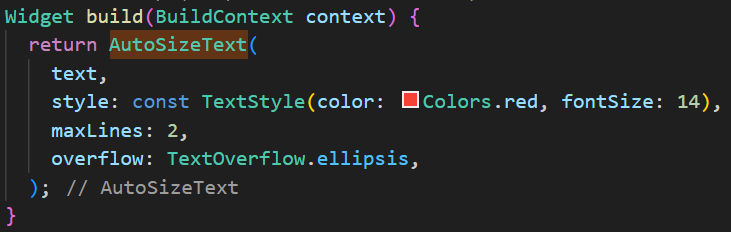

# Pemograman Mobile Gitbook 7
---
# Manajemen Plugin

**Nama        : An Naastasya S.**  
**Absensi     : 03**  
**NIM         : 2341760131**  
**Kelas       : SIB 3F**  

---

## Praktikum Menerapkan Plugin di Project Flutter
---
- Mebuah project Flutter baru dengan nama flutter_plugin_pubdev

- Perintah akan secara otomatis menambahkan dependensi (plugin) auto_size_text ke dalam file pubspec.yaml pada bagian dependencies.

- Langkah ini membuat custom widget bernama RedTextWidget yang akan menampilkan teks berwarna merah. Untuk sementara, widget hanya menampilkan Container kosong sebagai tempat menampung isi yang akan ditambahkan nanti.

- Kode menggunakan widget AutoSizeText dari plugin auto_size_text yang sudah diinstal. Widget ini memungkinkan teks otomatis mengecil jika melebihi batas lebar atau tinggi yang tersedia, agar tetap terlihat utuh tanpa overflow.

- Mendefinisikan variabel teks yang akan diterima oleh widget. Dengan menambahkan parameter required this text, setiap kali RedTextWidget dipanggil, harus disertai nilai untuk teks yang akan ditampilkan.

- Menambahkan dua Container ke dalam bagian children pada file main.dart (biasanya di dalam fungsi _MyHomePageState).

Hasil apabila project berhasil di run.

---
## Tugas Praktikum 
---

1. Jelaskan maksud dari langkah 2 pada praktikum tersebut!

- Langkah 2 bertujuan untuk menambahkan plugin auto_size_text dari pub.dev ke dalam proyek Flutter agar bisa digunakan untuk menampilkan teks yang otomatis menyesuaikan ukuran font-nya sesuai ruang tampilan.
2. Jelaskan maksud dari langkah 5 pada praktikum tersebut!

- Langkah 5 berfungsi untuk menambahkan variabel text dan parameter wajib di constructor agar widget RedTextWidget dapat menerima dan menampilkan teks dari luar saat dipanggil.
3. Pada langkah 6 terdapat dua widget yang ditambahkan, jelaskan fungsi dan perbedaannya!

- Pada langkah 6, widget pertama (RedTextWidget) menampilkan teks berwarna merah yang menyesuaikan ukuran huruf secara otomatis, sedangkan widget kedua (Text) menampilkan teks biasa tanpa penyesuaian ukuran sehingga bisa terpotong jika ruangnya sempit.
4. Jelaskan maksud dari tiap parameter yang ada di dalam plugin auto_size_text berdasarkan tautan pada dokumentasi ini !

- Parameter pada AutoSizeText memiliki fungsi: text untuk isi teks, style untuk mengatur gaya teks (warna dan ukuran), maxLines untuk batas jumlah baris teks, dan overflow untuk menampilkan tanda “...” jika teks terlalu panjang.